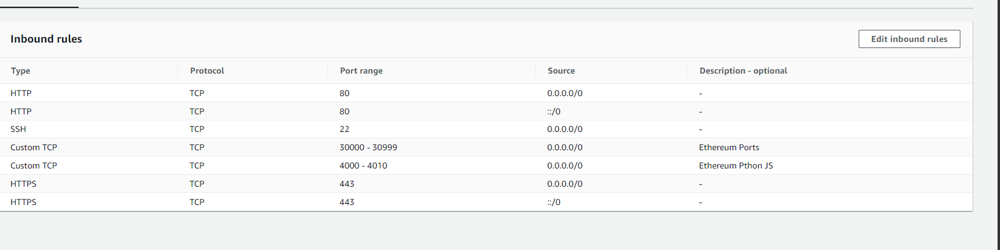
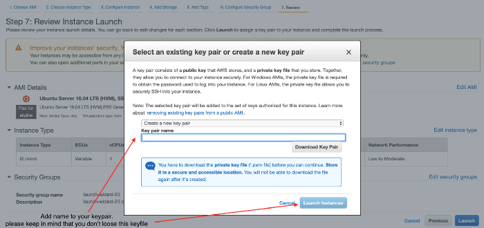
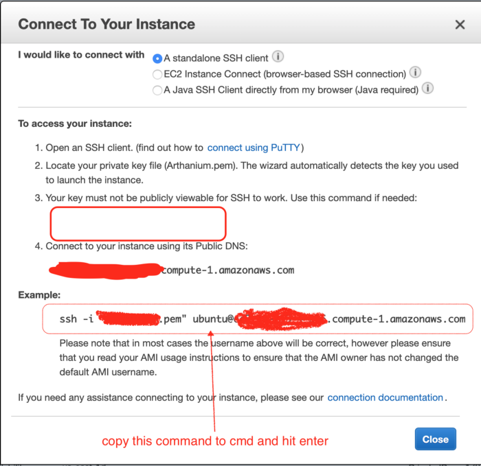

# SETUP GETH POA on AWS
---
## Create an EC2 instance
- click on launch instance 
- Ubuntu Server 18.04 LTS (HVM), SSD Volume Type (64-bit)
- Choose t2.medium
- Next Next Next until you reach Configure Security Group
- Setup like below

- Launch
## SSH key pair
- When you launch you will get a window like below (please save your key pair carefully)
- It takes at least 5 to 10 min to complete build once it’s done you can check the new instance after

## Connect via ssh
- Once Launched click on "Connect" button next to launch
- it will show you all the options to connect, open the command line and type the "ssh -i..." part and now you should be connectd to aws instance

## Create an Elastic IP (as instance ips refresh create an elastic IP)
- On the main screen you will have Elastic IP follow along (its quite simple)

---
# GETH 
---

> run the below commands

- sudo apt-get install
- software-properties-common
- sudo add-apt-repository -y ppa:ethereum/ethereum
- sudo apt-get update
- sudo apt-get install ethereum
- sudo apt install nginx
- sudo ufw enable
- sudo ufw allow 'Nginx Full'
- sudo ufw allow 'OpenSSH'
- sudo add-apt-repository ppa:certbot/certbot
- sudo apt install python-certbot-nginx
- sudo ufw status
`
> now check the status of ufw by typing — sudo ufw status

Output
Status: active
To                         Action      From
--                         ------      ----
OpenSSH                    ALLOW       Anywhere                  
Nginx HTTP                 ALLOW       Anywhere                  
OpenSSH (v6)               ALLOW       Anywhere (v6)             
Nginx HTTP (v6)            ALLOW       Anywhere (v6)

> then check for Nginx service — systemctl status nginx

- mkdir testnet
- cd testnet
- mkdir node1 node2
- geth --datadir node1/ account new
- geth --datadir node2/ account new

> run pupeth
> Please specify a network name to administer (no spaces, please)
> devnet
What would you like to do? (default = stats)
 1. Show network stats
 2. Configure new genesis
 3. Track new remote server
 4. Deploy network components
> 2
Which consensus engine to use? (default = clique)
 1. Ethash - proof-of-work
 2. Clique - proof-of-authority
> 2
How many seconds should blocks take? (default = 15)
> 3 // in case you want to mine on demand then make it 0
Which accounts are allowed to seal? (mandatory at least one)
> 6e4b4a14ca279a976cd56c9ab238061c567a3001 // remove 0x from the address and copy paste it here.
> c771e941e47d2e8a432790c5482920c9cf16f0b4
Which accounts should be pre-funded? (advisable at least one)
> 0x518Ba9843d9a9c351B3c3B8719408583246c9241 // again same step for ethers.
> 0x6a9c3c4d6e60c2c47d21ef607a00ccbb7ca3a581
Specify your chain/network ID if you want an explicit one (default = random)
> 48333442 // for example. Do not use anything from 1 to 10
What would you like to do? (default = stats)
1. Show network stats
2. Manage existing genesis
3. Track new remote server
4. Deploy network components
> 2
1. Modify existing configurations
2. Export genesis configurations
3. Remove genesis configuration
> 2
Which folder to save the genesis specs into? (default = current)
Will create genesis.json, genesis-aleth.json, genesis-harmony.json, genesis-parity.json
>INFO [09-29|14:47:47.760] Saved native genesis chain spec          path=genesis.json
ERROR[09-29|14:47:47.760] Failed to create Aleth chain spec        err="unsupported consensus engine"
ERROR[09-29|14:47:47.761] Failed to create Parity chain spec       err="unsupported consensus engine"
INFO [09-29|14:47:47.762] Saved genesis chain spec                 client=harmony path=genesis-harmony.json
What would you like to do? (default = stats)
1. Show network stats
2. Manage existing genesis
3. Track new remote server
4. Deploy network components
> ^C // ctrl+C to quit puppeth

> geth --datadir node1/ init genesis.json
> geth --datadir node2/ init genesis.json
> bootnode -genkey boot.key
> bootnode -nodekey boot.key -verbosity 9 -addr :30310
> output >>
bootnode -genkey boot.key
bootnode -nodekey boot.key -verbosity 9 -addr :30310

> enode://596f5fb26b27b0fb54756c180b4449fae7a246dc8e4c7bb4be2e2553c4fb83de64c64d1891ea1823aa6204fe777efb8add428e3e3d142318446aca3cc43366cc@127.0.0.1:30310

>geth --datadir node1/ --syncmode 'full' --port 30311 --rpc --rpcaddr '0.0.0.0' --rpcport 8501 --rpcapi 'personal,db,eth,net,web3,txpool,miner' --bootnodes 'enode://596f5fb26b27b0fb54756c180b4449fae7a246dc8e4c7bb4be2e2553c4fb83de64c64d1891ea1823aa6204fe777efb8add428e3e3d142318446aca3cc43366cc@127.0.0.1:30310' --networkid 48333442 --gasprice '1' --unlock '6e4b4a14ca279a976cd56c9ab238061c567a3001' --password password1.txt --rpcvhosts=* --allow-insecure-unlock --mine

>geth --datadir node2/ --syncmode 'full' --port 30312 --rpc --rpcaddr '0.0.0.0' --rpcport 8502 --rpcapi 'personal,db,eth,net,web3,txpool,miner' --bootnodes 'enode://596f5fb26b27b0fb54756c180b4449fae7a246dc8e4c7bb4be2e2553c4fb83de64c64d1891ea1823aa6204fe777efb8add428e3e3d142318446aca3cc43366cc@127.0.0.1:30310' --networkid 48333442 --gasprice '1' --unlock 'c771e941e47d2e8a432790c5482920c9cf16f0b4' --password password2.txt --rpcvhosts=* --allow-insecure-unlock --mine

