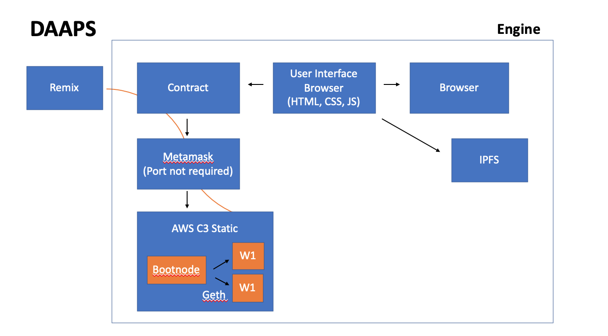
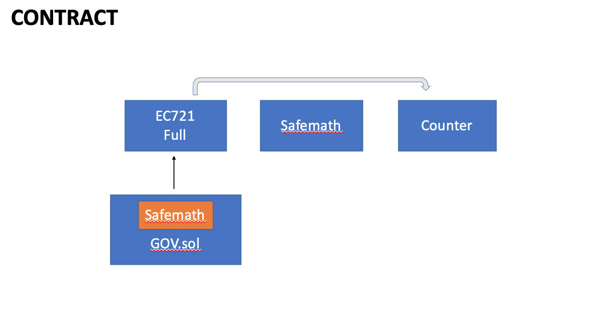

## PUPPY PRESIDENTIAL ELECTIONS 

You can use the [editor on GitHub](https://github.com/caseyqburke/project3/edit/gh-pages/index.md) to maintain and preview the content for your website in Markdown files.

[Puppy Presidential Elections](https://pup-elections.herokuapp.com/)    

### Markdown

Markdown is a lightweight and easy-to-use syntax for styling your writing. It includes conventions for


## OVERVIEW


## ARCHITECTURE 
ARCHITECTURE



## DETAILS

- Bulleted
- List

## CONTRACT SPECS
1. Numbered
2. List


## PROS/CONS

**Bold** and _Italic_ and `Code` text

[Puppy Presidential Elections](url) and [Puppy Presidential Elections](url) and 
```



### Jekyll Themes

Your Pages site will use the layout and styles from the Jekyll theme you have selected in your [repository settings](https://github.com/caseyqburke/project3/settings). The name of this theme is saved in the Jekyll `_config.yml` configuration file.

### Support or Contact

Having trouble with Pages? Check out our [documentation](https://docs.github.com/categories/github-pages-basics/) or [contact support](https://github.com/contact) and we’ll help you sort it out.
