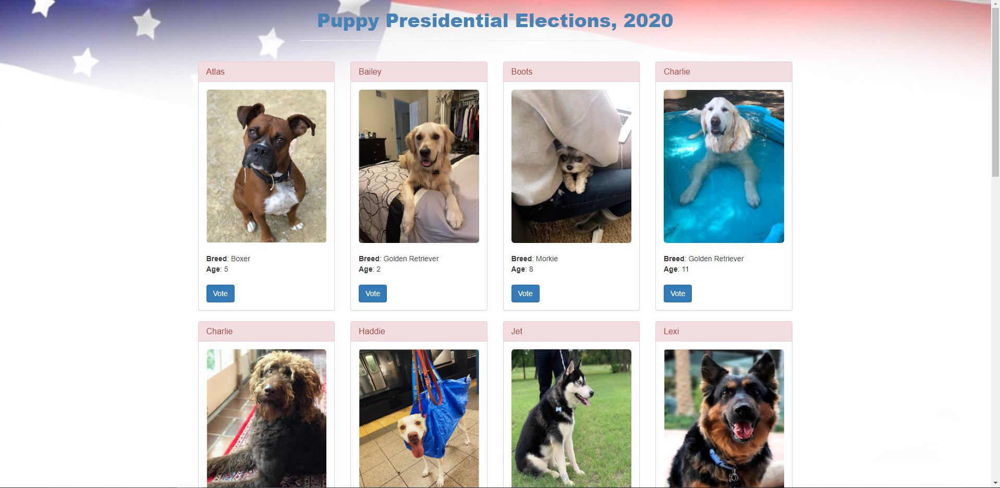

## PUPPY PRESIDENTIAL ELECTIONS 


[Puppy Presidential Elections](https://pup-elections.netlify.app/)    

### OBJECTIVE
Create and deploy fully decentralized end to end  DAPP


## OVERVIEW
Inspired by the current presidential elections our project seeks to provide an alternative to the traditional methods of voting in a presidential election. 
We wanted to highlight how blockchain technology could ensure strict compliance with the principles of democratic elections.
1. Freedom to vote.
A dapp can expand voting access
2. Secrecy of vote.*
3. Non-modification of the votes cast.
Blockchain data is immutable
4. Lack of intimidation during elections.

            * Since transactions are not truly secret in the Ethereum blockchain more robust alternatives like Quorum are needed.

Some of the current challenges of paper-based/ traditional voting:
---Human error handling paper ballots.
---Ease of manipulation.
---COVID-19 has limited in person voting.


## ARCHITECTURE 
ARCHITECTURE


#### AWS

View the AWS work here https://github.com/shubhra13/CryptoKnights/tree/master/aws


## DETAILS

Basic Principles of Voting
-Only eligible voters have the right to vote.
-Every vote cast is only counted once.
-Every voter is free to make his/her decisions without intimidation or coercion.
-The secrecy of vote is maintained throughout the voting process.
-Every eligible voter has access to vote without prejudice to educational level, location and disability.
-The entire voting process is very transparent.


## TECH AND TOOLS
- For this DAPP we applied a variety of technologies and tools 
1. AWS ec2 instances
2. AWS elastic tip
3. Geth
4. Solidity
5. Remix(IDE)
6. Metamask
7. Ganache
8. Truffle Suite(for deployment)
9. Netlify
10. Javascript
11. HTML
12. CSS


## PROS/CONS
One of the major pros of this DAPP was the easy use and effieincy. Makes the voting process more accessible and quicker than the current way. 
One con is security issues. 

[Puppy Presidential Elections](url) and [Puppy Presidential Elections](url) and 
```


